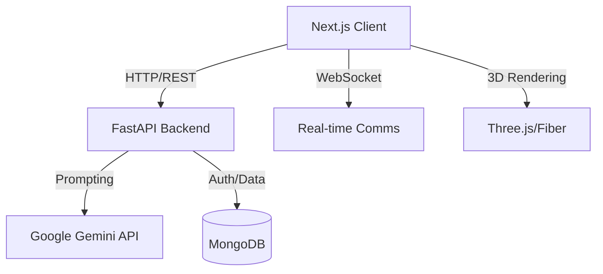

# 🧪 Elixra - The AI-Powered Chemistry Lab

<div align="center">
  
  <br />
  <h3>Immersive Chemistry Education Platform</h3>
  
  [](https://nextjs.org/)
  [](https://fastapi.tiangolo.com/)
  [](https://deepmind.google/technologies/gemini/)
  [](https://www.mongodb.com/)
</div>

---

## 📑 Table of Contents
- [Overview](#-overview)
- [Key Features](#-key-features)
- [Architecture](#-architecture)
- [Project Structure](#-project-structure)
- [Installation & Setup](#-installation--setup)
- [Configuration](#-configuration)
- [API Documentation](#-api-documentation)
- [Virtual Lab Equipment](#-virtual-lab-equipment)
- [Contributing](#-contributing)
- [License](#-license)

---

## 🔭 Overview

**Elixra** is a next-generation educational platform that bridges the gap between theoretical chemistry and practical application. By leveraging **Google's Gemini AI**, 3D visualization technologies, and gamified learning paths, Elixra provides students with a safe, interactive, and intelligent environment to master complex chemical concepts.

### Value Proposition
- **Safe Experimentation**: Perform dangerous or costly reactions in a risk-free virtual environment.
- **Personalized Tutoring**: **ERA (Elixra Reactive Assistant)** provides real-time, context-aware guidance tailored to the student's learning pace.
- **Visual Learning**: Interact with 3D molecular structures and simulated lab equipment to build intuitive understanding.

---

## 🚀 Key Features

| Feature | Description |
|:---:|:---|
|  <br> **Virtual Lab** | Interactive workbench with realistic equipment physics and chemical reaction simulations. |
|  <br> **AI Tutor (ERA)** | Intelligent assistant for Q&A, experiment guidance, and concept explanation. |
|  <br> **Adaptive Quizzes** | Dynamic question generation (MCQ, Reactions) with detailed performance analysis. |
|  <br> **3D Molecules** | Interactive 3D viewer for atomic structures, bonding, and molecular geometry. |
|  <br> **Collaboration** | Real-time collaborative features for group experiments and peer learning. |

---

## 🏗 Architecture

Elixra follows a modern **Service-Oriented Architecture (SOA)**:



- **Frontend**: Next.js 14 (App Router), Tailwind CSS, Framer Motion, React Three Fiber.
- **Backend**: FastAPI (Python), Uvicorn.
- **AI Engine**: Google Generative AI (Gemini 2.5 Flash).
- **Database**: MongoDB (User data, progress tracking).

---

## 📂 Project Structure

```bash
d:\Elixra\build-o-thon
├── 📁 app/                 # Next.js App Router pages & API routes
│   ├── 📁 quiz/            # Quiz module (UI & Logic)
│   ├── 📁 lab/             # Virtual Lab environment
│   ├── 📁 api/             # Next.js Serverless Functions
│   └── ...
├── 📁 backend/             # Python FastAPI Server
│   ├── main.py             # Entry point & API definitions
│   └── requirements.txt    # Python dependencies
├── 📁 components/          # Reusable React components
│   ├── 📁 equipment-effects/ # Visual effects for lab gear
│   └── ...
├── 📁 public/              # Static assets
│   └── 📁 Assets/          # SVGs and icons
├── 📁 lib/                 # Utility functions & configs
└── ...
```

---

## ⚙ Installation & Setup

### Prerequisites
- **Node.js** (v18+)
- **Python** (v3.10+)
- **MongoDB** (Local or Atlas)
- **Google Cloud API Key** (for Gemini)

### 1. Clone the Repository
```bash
git clone https://github.com/dpp0007/build-o-thon.git
cd build-o-thon
```

### 2. Frontend Setup
```bash
# Install Node dependencies
npm install

# Start Development Server
npm run dev
# > Ready on http://localhost:3000
```

### 3. Backend Setup
```bash
cd backend

# Create Virtual Environment (Optional but recommended)
python -m venv venv
# Windows: venv\Scripts\activate
# Mac/Linux: source venv/bin/activate

# Install Python dependencies
pip install -r requirements.txt

# Start FastAPI Server
python main.py
# > Chemistry Avatar API Starting...
# > Backend URL: http://localhost:8000
```

---

## 📜 Scripts

- `npm run dev` — Starts the Next.js development server on port 3000
- `npm run build` — Generates an optimized production build
- `npm run start` — Starts the production server (default port 3000)
- `npm run lint` — Runs ESLint checks

Optional:
- `npx vitest` — Runs tests if/when test suites are added (see components/__tests__)

---

## 🔧 Configuration

Create a `.env` file in the root directory:

| Variable | Description | Required |
|:---|:---|:---:|
| `GEMINI_API_KEY` | API Key for Google Gemini Model | ✅ |
| `MONGODB_URI` | Connection string for MongoDB | ✅ |
| `NEXTAUTH_SECRET` | Secret key for session encryption | ✅ |
| `NEXTAUTH_URL` | Base URL (e.g., http://localhost:3000) | ✅ |

---

## 🧪 Testing & Linting

- Lint: `npm run lint`
- Unit tests: `npx vitest` (Vitest is installed; suites can be added in components/__tests__)
- Type checking: Next.js build runs TypeScript validation; you can also run `npx tsc --noEmit`

---

## 🔄 Development Workflow

- Branches:
  - `main` — Stable branch
  - Feature branches — e.g., `spectroscopy`, `lab-equipment`
- Workflow:
  - Create a feature branch
  - Implement changes
  - Run lint and build locally
  - Open a Pull Request into `main`

---

## 📡 API Documentation

The backend exposes several key endpoints. Full Swagger docs available at `http://localhost:8000/docs`.

### Quiz Generation
- **Endpoint**: `POST /quiz/generate`
- **Body**:
  ```json
  {
    "difficulty": "medium",
    "num_questions": 5,
    "question_types": ["mcq", "explanation"],
    "include_timer": true
  }
  ```

### AI Chat (Streaming)
- **Endpoint**: `POST /chat`
- **Body**:
  ```json
  {
    "message": "Explain covalent bonding",
    "context": "User is looking at a Carbon atom",
    "history": []
  }
  ```

---

## ⚗ Virtual Lab Equipment

Elixra features a suite of interactive tools:

<div align="center">
  
  
  
  
</div>

---

## 🔬 Spectroscopy Pipeline (Frontend)

- Generation route: [route.ts](file:///d:/Elixra/build-o-thon/app/api/spectroscopy/generate/route.ts)
  - Prompts the AI to return detailed, multi-peak spectra and uses Unicode subscripts (e.g., CH₂).
- Data handlers: [spectrumHandlers.ts](file:///d:/Elixra/build-o-thon/lib/spectrumHandlers.ts)
  - Processes API JSON and preserves specific labels without generic fallbacks.
- Page integration: [page.tsx](file:///d:/Elixra/build-o-thon/app/spectroscopy/page.tsx)
  - Maps dynamic keys robustly (case-insensitive) and formats formulas with subscripts.
- Graph rendering: [SpectrumGraph.tsx](file:///d:/Elixra/build-o-thon/components/SpectrumGraph.tsx)
  - Smart tooltip positioning (clamping Y, flipping placement when needed).

---

## 🧱 Molecule Viewer Highlights

- Main page: [page.tsx](file:///d:/Elixra/build-o-thon/app/molecules/page.tsx)
- Quick Actions include:
  - Periodic Table and Templates
  - Undo/Redo
  - Clear All — resets atoms, bonds, analysis, and validation
- 3D Viewer: [EnhancedMolecule3DViewer.tsx](file:///d:/Elixra/build-o-thon/components/EnhancedMolecule3DViewer.tsx)
- Bonding logic: [bondingLogic.ts](file:///d:/Elixra/build-o-thon/lib/bondingLogic.ts)
- Validation: [chemicalValidation.ts](file:///d:/Elixra/build-o-thon/lib/chemicalValidation.ts)

---

## 🛡 Security & Secrets

- Never commit real API keys or credentials.
- Use `.env` (and `.env.local` for machine-specific overrides).
- See `.env.example` for the required variables.

---

## 🧰 Troubleshooting

- ChunkLoadError or outdated client files:
  - Stop the dev server, delete `.next/`, then `npm run dev` again.
- ESLint warnings:
  - `@next/next/no-img-element`: Use `next/image` instead of `img` for optimized loading.
  - `react-hooks/exhaustive-deps`: Include all dependencies or refactor with stable callbacks.
- TypeScript errors (e.g., NMR multiplicity):
  - Multiplicity types live in [spectroscopy.ts](file:///d:/Elixra/build-o-thon/types/spectroscopy.ts). Ensure union includes all used descriptors.

---

## 🤝 Contributing

We welcome contributions! Please follow these steps:

1.  **Fork** the repository.
2.  Create a **Feature Branch** (`git checkout -b feature/NewExperiment`).
3.  **Commit** your changes (`git commit -m 'Add titration simulation'`).
4.  **Push** to the branch (`git push origin feature/NewExperiment`).
5.  Open a **Pull Request**.

### Coding Standards
- **Frontend**: Follow ESLint rules, use functional components and Hooks.
- **Backend**: Type hints (Pydantic), PEP 8 compliance.

---

## 📄 License

This project is licensed under the **MIT License**. See the `LICENSE` file for details.

---

<div align="center">
  <sub>Built with ❤️ for the Future of Science Education</sub>
</div>
